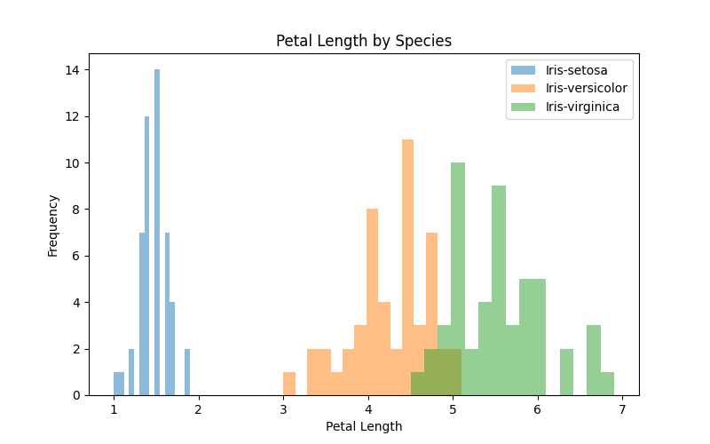
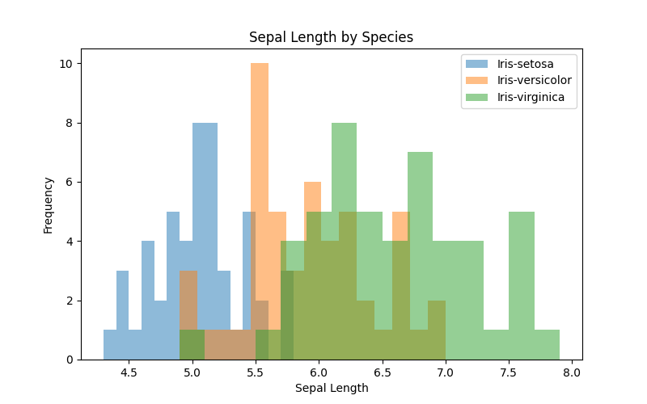

# Iris Species Exploratory Data Analysis With SQL


## Introduction
The Iris dataset contains four measurements from iris flowers: sepal length, sepal width, petal length, and petal width, along with the species label (Setosa, Versicolor, Virginica).  
**Goal:**  Use SQL to explore the data, summarize key features, and draw insights about differences across species.
**Questions:**
1) Which measurements are strongly correlated?
2) How do measurements vary by species?

## Data Loading
The dataset was imported into PostgreSQL using a csv file.
```sql
DROP TABLE IF EXISTS Public.iris;
--creating the table
CREATE TABLE Public."iris" (sepal_length REAL, sepal_width REAL, petal_length REAL, petal_width REAL, species VARCHAR(100));
--copying the data into the table
COPY iris (sepal_length, sepal_width, petal_length, petal_width, species ) FROM 'C:\Users\thehi\Downloads\iris_data.csv' DELIMITER ',' CSV HEADER;
--displaying table to ensure the data was imported properly
SELECT * FROM iris;
```
## Exploring the Data
We start this exploration by examining the shape of the data, examining the data types, checking for missing values and examining the summary statistics. 
```sql
--counting the number of rows
SELECT COUNT(*) AS row_count FROM iris;
--counting the number of columns
SELECT COUNT(column_name) AS column_count
FROM information_schema.columns
WHERE table_schema = 'public'
  AND table_name = 'iris';
--showing the data type of each column
SELECT column_name, data_type
FROM information_schema.columns
WHERE table_schema = 'public'
  AND table_name = 'iris';
--counting all the NULL values
SELECT COUNT(*) AS null_rows
FROM public.iris
WHERE (sepal_length IS NULL
       OR sepal_width IS NULL
       OR petal_length IS NULL
       OR petal_width IS NULL
	   Or species IS NULL);
```
Now we examine the summary summary statistics:
```sql
--sepal_length statistics
WITH stats_sepal_length AS (
    SELECT 
		AVG(sepal_length) AS mean_val,
		PERCENTILE_CONT(0.5) WITHIN GROUP (ORDER BY sepal_length) AS median_val,
		MODE() WITHIN GROUP (ORDER BY sepal_length) AS mode_val,
        MIN(sepal_length) AS min_val,
        MAX(sepal_length) AS max_val,
		MAX(sepal_length) - MIN(sepal_length) AS range_val,
		STDDEV(sepal_length) AS stddev_val,
		VARIANCE(sepal_length) AS variance_val,
        PERCENTILE_CONT(0.25) WITHIN GROUP (ORDER BY sepal_length) AS q1_val,
        PERCENTILE_CONT(0.75) WITHIN GROUP (ORDER BY sepal_length) AS q3_val,
		PERCENTILE_CONT(0.75) WITHIN GROUP (ORDER BY sepal_length) - PERCENTILE_CONT(0.25) WITHIN GROUP (ORDER BY sepal_length) AS iqr_val,
        3 * (AVG(sepal_length) - PERCENTILE_CONT(0.5) WITHIN GROUP (ORDER BY sepal_length)) / NULLIF(STDDEV(sepal_length), 0) AS skewness_val
    FROM public.iris
)

SELECT 1 AS sno,'Mean' AS statistic, ROUND(mean_val::NUMERIC, 2) AS value FROM stats_sepal_length UNION ALL
SELECT 2,'Median', ROUND(median_val::NUMERIC, 2) FROM stats_sepal_length UNION ALL
SELECT 3,'Mode', ROUND(mode_val::NUMERIC, 2) FROM stats_sepal_length UNION ALL
SELECT 4, 'Minimum', ROUND(min_val::NUMERIC, 2) FROM stats_sepal_length UNION ALL
SELECT 5,'Maximum', ROUND(max_val::NUMERIC, 2) FROM stats_sepal_length UNION ALL
SELECT 6,'Range', ROUND(range_val::NUMERIC, 2) FROM stats_sepal_length UNION ALL
SELECT 7,'Standard Deviation', ROUND(stddev_val::NUMERIC, 2) FROM stats_sepal_length UNION ALL
SELECT 8,'Variance', ROUND(variance_val::NUMERIC, 2) FROM stats_sepal_length UNION ALL
SELECT 9,'Q1', ROUND(q1_val::NUMERIC, 2) FROM stats_sepal_length UNION ALL
SELECT 10,'Q3', ROUND(q3_val::NUMERIC, 2) FROM stats_sepal_length UNION ALL
SELECT 11,'IQR', ROUND(iqr_val::NUMERIC, 2) FROM stats_sepal_length UNION ALL
SELECT 12,'Skewness', ROUND(skewness_val::NUMERIC, 2) FROM stats_sepal_length;


--sepal_width statistics
WITH stats_sepal_width AS (
    SELECT 
		AVG(sepal_width) AS mean_val,
		PERCENTILE_CONT(0.5) WITHIN GROUP (ORDER BY sepal_width) AS median_val,
		MODE() WITHIN GROUP (ORDER BY sepal_width) AS mode_val,
        MIN(sepal_width) AS min_val,
        MAX(sepal_width) AS max_val,
		MAX(sepal_width) - MIN(sepal_width) AS range_val,
		STDDEV(sepal_width) AS stddev_val,
		VARIANCE(sepal_width) AS variance_val,
        PERCENTILE_CONT(0.25) WITHIN GROUP (ORDER BY sepal_width) AS q1_val,
        PERCENTILE_CONT(0.75) WITHIN GROUP (ORDER BY sepal_width) AS q3_val,
		PERCENTILE_CONT(0.75) WITHIN GROUP (ORDER BY sepal_width) - PERCENTILE_CONT(0.25) WITHIN GROUP (ORDER BY sepal_width) AS iqr_val,
        3 * (AVG(sepal_width) - PERCENTILE_CONT(0.5) WITHIN GROUP (ORDER BY sepal_width)) / NULLIF(STDDEV(sepal_width), 0) AS skewness_val
    FROM public.iris
)

SELECT 1 AS sno,'Mean' AS statistic, ROUND(mean_val::NUMERIC, 2) AS value FROM stats_sepal_width UNION ALL
SELECT 2,'Median', ROUND(median_val::NUMERIC, 2) FROM stats_sepal_width UNION ALL
SELECT 3,'Mode', ROUND(mode_val::NUMERIC, 2) FROM stats_sepal_width UNION ALL
SELECT 4, 'Minimum', ROUND(min_val::NUMERIC, 2) FROM stats_sepal_width UNION ALL
SELECT 5,'Maximum', ROUND(max_val::NUMERIC, 2) FROM stats_sepal_width UNION ALL
SELECT 6,'Range', ROUND(range_val::NUMERIC, 2) FROM stats_sepal_width UNION ALL
SELECT 7,'Standard Deviation', ROUND(stddev_val::NUMERIC, 2) FROM stats_sepal_width UNION ALL
SELECT 8,'Variance', ROUND(variance_val::NUMERIC, 2) FROM stats_sepal_width UNION ALL
SELECT 9,'Q1', ROUND(q1_val::NUMERIC, 2) FROM stats_sepal_width UNION ALL
SELECT 10,'Q3', ROUND(q3_val::NUMERIC, 2) FROM stats_sepal_width UNION ALL
SELECT 11,'IQR', ROUND(iqr_val::NUMERIC, 2) FROM stats_sepal_width UNION ALL
SELECT 12,'Skewness', ROUND(skewness_val::NUMERIC, 2) FROM stats_sepal_width;


--petal_length statistics
WITH stats_petal_length AS (
    SELECT 
		AVG(petal_length) AS mean_val,
		PERCENTILE_CONT(0.5) WITHIN GROUP (ORDER BY petal_length) AS median_val,
		MODE() WITHIN GROUP (ORDER BY petal_length) AS mode_val,
        MIN(petal_length) AS min_val,
        MAX(petal_length) AS max_val,
		MAX(petal_length) - MIN(petal_length) AS range_val,
		STDDEV(petal_length) AS stddev_val,
		VARIANCE(petal_length) AS variance_val,
        PERCENTILE_CONT(0.25) WITHIN GROUP (ORDER BY petal_length) AS q1_val,
        PERCENTILE_CONT(0.75) WITHIN GROUP (ORDER BY petal_length) AS q3_val,
		PERCENTILE_CONT(0.75) WITHIN GROUP (ORDER BY petal_length) - PERCENTILE_CONT(0.25) WITHIN GROUP (ORDER BY petal_length) AS iqr_val,
        3 * (AVG(petal_length) - PERCENTILE_CONT(0.5) WITHIN GROUP (ORDER BY petal_length)) / NULLIF(STDDEV(petal_length), 0) AS skewness_val
    FROM public.iris
)

SELECT 1 AS sno,'Mean' AS statistic, ROUND(mean_val::NUMERIC, 2) AS value FROM stats_petal_length UNION ALL
SELECT 2,'Median', ROUND(median_val::NUMERIC, 2) FROM stats_petal_length UNION ALL
SELECT 3,'Mode', ROUND(mode_val::NUMERIC, 2) FROM stats_petal_length UNION ALL
SELECT 4, 'Minimum', ROUND(min_val::NUMERIC, 2) FROM stats_petal_length UNION ALL
SELECT 5,'Maximum', ROUND(max_val::NUMERIC, 2) FROM stats_petal_length UNION ALL
SELECT 6,'Range', ROUND(range_val::NUMERIC, 2) FROM stats_petal_length UNION ALL
SELECT 7,'Standard Deviation', ROUND(stddev_val::NUMERIC, 2) FROM stats_petal_length UNION ALL
SELECT 8,'Variance', ROUND(variance_val::NUMERIC, 2) FROM stats_petal_length UNION ALL
SELECT 9,'Q1', ROUND(q1_val::NUMERIC, 2) FROM stats_petal_length UNION ALL
SELECT 10,'Q3', ROUND(q3_val::NUMERIC, 2) FROM stats_petal_length UNION ALL
SELECT 11,'IQR', ROUND(iqr_val::NUMERIC, 2) FROM stats_petal_length UNION ALL
SELECT 12,'Skewness', ROUND(skewness_val::NUMERIC, 2) FROM stats_petal_length;


--petal_width statistics
WITH stats_petal_width AS (
    SELECT 
		AVG(petal_width) AS mean_val,
		PERCENTILE_CONT(0.5) WITHIN GROUP (ORDER BY petal_width) AS median_val,
		MODE() WITHIN GROUP (ORDER BY petal_width) AS mode_val,
        MIN(petal_width) AS min_val,
        MAX(petal_width) AS max_val,
		MAX(petal_width) - MIN(petal_width) AS range_val,
		STDDEV(petal_width) AS stddev_val,
		VARIANCE(petal_width) AS variance_val,
        PERCENTILE_CONT(0.25) WITHIN GROUP (ORDER BY petal_width) AS q1_val,
        PERCENTILE_CONT(0.75) WITHIN GROUP (ORDER BY petal_width) AS q3_val,
		PERCENTILE_CONT(0.75) WITHIN GROUP (ORDER BY petal_width) - PERCENTILE_CONT(0.25) WITHIN GROUP (ORDER BY petal_width) AS iqr_val,
        3 * (AVG(petal_width) - PERCENTILE_CONT(0.5) WITHIN GROUP (ORDER BY petal_width)) / NULLIF(STDDEV(petal_width), 0) AS skewness_val
    FROM public.iris
)

SELECT 1 AS sno,'Mean' AS statistic, ROUND(mean_val::NUMERIC, 2) AS value FROM stats_petal_width UNION ALL
SELECT 2,'Median', ROUND(median_val::NUMERIC, 2) FROM stats_petal_width UNION ALL
SELECT 3,'Mode', ROUND(mode_val::NUMERIC, 2) FROM stats_petal_width UNION ALL
SELECT 4, 'Minimum', ROUND(min_val::NUMERIC, 2) FROM stats_petal_width UNION ALL
SELECT 5,'Maximum', ROUND(max_val::NUMERIC, 2) FROM stats_petal_width UNION ALL
SELECT 6,'Range', ROUND(range_val::NUMERIC, 2) FROM stats_petal_width UNION ALL
SELECT 7,'Standard Deviation', ROUND(stddev_val::NUMERIC, 2) FROM stats_petal_width UNION ALL
SELECT 8,'Variance', ROUND(variance_val::NUMERIC, 2) FROM stats_petal_width UNION ALL
SELECT 9,'Q1', ROUND(q1_val::NUMERIC, 2) FROM stats_petal_width UNION ALL
SELECT 10,'Q3', ROUND(q3_val::NUMERIC, 2) FROM stats_petal_width UNION ALL
SELECT 11,'IQR', ROUND(iqr_val::NUMERIC, 2) FROM stats_petal_width UNION ALL
SELECT 12,'Skewness', ROUND(skewness_val::NUMERIC, 2) FROM stats_petal_width;
```

| Number of Rows |
|:--------------:|
|150             |

| Number of columns |
|:-----------------:|
|5                  |

| Column Name      | Data Type|
|:----------------:|:------------------:|
|column_name	   |data_type
|sepal_width	   |real
|petal_length	   |real
|petal_width	   |real
|species	       |character varying

| Count of NULL values |
|:--------------------:|
|0

### Sepal Length Statistics
|    statistic   	| value |
|:-----------------:|:-----:|
|Mean	            |5.84
|Median          	|5.8
|Mode	            |5
|Minimum	        |4.3
|Maximum	        |7.9
|Range	            |3.6
|Standard Deviation	|0.83
|Variance	        |0.69
|Q1	                |5.1
||Q3	            |6.4
|IQR	            |1.3
|Skewness	        |0.16

### Sepal Width Statistics
|    statistic   	| value |
|:-----------------:|:-----:|
|Mean	            |3.05
|Median	            |3
|Mode	            |3
|Minimum	        |2
|Maximum	        |4.4
|Range	            |2.4
|Standard Deviation	|0.43
|Variance	        |0.19
|Q1	                |2.8
|Q3	                |3.3
|IQR	            |0.5
|Skewness	        |0.37

### Petal Length Statistics
|    statistic   	| value |
|:-----------------:|:-----:|
|Mean	            |3.76
|Median	            |4.35
|Mode	            |1.5
|Minimum	        |1
|Maximum	        |6.9
|Range	            |5.9
|Standard Deviation	|1.76
|Variance	        |3.11
|Q1	                |1.6
|Q3	                |5.1
|IQR	            |3.5
|Skewness	        |-1.01

### Petal Width Statistics
|    statistic   	| value |
|:-----------------:|:-----:|
|Mean	            |1.2
|Median	            |1.3
|Mode	            |0.2
|Minimum	        |0.1
|Maximum	        |2.5
|Range	            |2.4
|Standard Deviation	|0.76
|Variance	        |0.58
|Q1	                |0.3
||Q3	            |1.8
|IQR	            |1.5
|Skewness	        |-0.4

### Interpreting the Output:
The dataset contains four continuous numerical columns and one categorical column (species). Numerical measurements serve as independent variables, while species is the dependent variable. With 150 rows and no null values, the data is clean. Petal length and petal width show negative skew as the mean and median differ, as well as the mode being noticeably lower, suggesting certain species have consistently smaller petals. The petal length distribution indicates potential clumping at smaller values. This pattern likely corresponds to species differences, supporting the hypothesis that petal length depends on species. 
Sepal length and petal length are chosen as the key variable pair for further analysis.
 
## Grouping Data By Species
Now we can aggregate the data to summarize measurements by species.
```sql
-- examining the setosa table
SELECT * FROM iris
WHERE species = 'Iris-setosa';
--examining the versicolor table
SELECT * FROM iris
WHERE species = 'Iris-versicolor';
--examining the virginica table
SELECT * FROM iris
WHERE species = 'Iris-virginica';
```
Now we calculate summry staticstics for each species. 
```sql
--setosa sepal length stats
WITH stats_sepal_length AS (
    SELECT 
		AVG(sepal_length) AS mean_val,
		PERCENTILE_CONT(0.5) WITHIN GROUP (ORDER BY sepal_length) AS median_val,
		MODE() WITHIN GROUP (ORDER BY sepal_length) AS mode_val,
        MIN(sepal_length) AS min_val,
        MAX(sepal_length) AS max_val,
		MAX(sepal_length) - MIN(sepal_length) AS range_val,
		STDDEV(sepal_length) AS stddev_val,
		VARIANCE(sepal_length) AS variance_val,
        PERCENTILE_CONT(0.25) WITHIN GROUP (ORDER BY sepal_length) AS q1_val,
        PERCENTILE_CONT(0.75) WITHIN GROUP (ORDER BY sepal_length) AS q3_val,
		PERCENTILE_CONT(0.75) WITHIN GROUP (ORDER BY sepal_length) - PERCENTILE_CONT(0.25) WITHIN GROUP (ORDER BY sepal_length) AS iqr_val,
        3 * (AVG(sepal_length) - PERCENTILE_CONT(0.5) WITHIN GROUP (ORDER BY sepal_length)) / NULLIF(STDDEV(sepal_length), 0) AS skewness_val
    FROM public.iris
	WHERE species = 'Iris-setosa'
)

SELECT 1 AS sno,'Mean' AS statistic, ROUND(mean_val::NUMERIC, 2) AS value FROM stats_sepal_length UNION ALL
SELECT 2,'Median', ROUND(median_val::NUMERIC, 2) FROM stats_sepal_length UNION ALL
SELECT 3,'Mode', ROUND(mode_val::NUMERIC, 2) FROM stats_sepal_length UNION ALL
SELECT 4, 'Minimum', ROUND(min_val::NUMERIC, 2) FROM stats_sepal_length UNION ALL
SELECT 5,'Maximum', ROUND(max_val::NUMERIC, 2) FROM stats_sepal_length UNION ALL
SELECT 6,'Range', ROUND(range_val::NUMERIC, 2) FROM stats_sepal_length UNION ALL
SELECT 7,'Standard Deviation', ROUND(stddev_val::NUMERIC, 2) FROM stats_sepal_length UNION ALL
SELECT 8,'Variance', ROUND(variance_val::NUMERIC, 2) FROM stats_sepal_length UNION ALL
SELECT 9,'Q1', ROUND(q1_val::NUMERIC, 2) FROM stats_sepal_length UNION ALL
SELECT 10,'Q3', ROUND(q3_val::NUMERIC, 2) FROM stats_sepal_length UNION ALL
SELECT 11,'IQR', ROUND(iqr_val::NUMERIC, 2) FROM stats_sepal_length UNION ALL
SELECT 12,'Skewness', ROUND(skewness_val::NUMERIC, 2) FROM stats_sepal_length;

--setosa petal length stats
WITH stats_petal_length AS (
    SELECT 
		AVG(petal_length) AS mean_val,
		PERCENTILE_CONT(0.5) WITHIN GROUP (ORDER BY petal_length) AS median_val,
		MODE() WITHIN GROUP (ORDER BY petal_length) AS mode_val,
        MIN(petal_length) AS min_val,
        MAX(petal_length) AS max_val,
		MAX(petal_length) - MIN(petal_length) AS range_val,
		STDDEV(petal_length) AS stddev_val,
		VARIANCE(petal_length) AS variance_val,
        PERCENTILE_CONT(0.25) WITHIN GROUP (ORDER BY petal_length) AS q1_val,
        PERCENTILE_CONT(0.75) WITHIN GROUP (ORDER BY petal_length) AS q3_val,
		PERCENTILE_CONT(0.75) WITHIN GROUP (ORDER BY petal_length) - PERCENTILE_CONT(0.25) WITHIN GROUP (ORDER BY petal_length) AS iqr_val,
        3 * (AVG(petal_length) - PERCENTILE_CONT(0.5) WITHIN GROUP (ORDER BY petal_length)) / NULLIF(STDDEV(petal_length), 0) AS skewness_val
    FROM public.iris
	WHERE species = 'Iris-setosa'
)

SELECT 1 AS sno,'Mean' AS statistic, ROUND(mean_val::NUMERIC, 2) AS value FROM stats_petal_length UNION ALL
SELECT 2,'Median', ROUND(median_val::NUMERIC, 2) FROM stats_petal_length UNION ALL
SELECT 3,'Mode', ROUND(mode_val::NUMERIC, 2) FROM stats_petal_length UNION ALL
SELECT 4, 'Minimum', ROUND(min_val::NUMERIC, 2) FROM stats_petal_length UNION ALL
SELECT 5,'Maximum', ROUND(max_val::NUMERIC, 2) FROM stats_petal_length UNION ALL
SELECT 6,'Range', ROUND(range_val::NUMERIC, 2) FROM stats_petal_length UNION ALL
SELECT 7,'Standard Deviation', ROUND(stddev_val::NUMERIC, 2) FROM stats_petal_length UNION ALL
SELECT 8,'Variance', ROUND(variance_val::NUMERIC, 2) FROM stats_petal_length UNION ALL
SELECT 9,'Q1', ROUND(q1_val::NUMERIC, 2) FROM stats_petal_length UNION ALL
SELECT 10,'Q3', ROUND(q3_val::NUMERIC, 2) FROM stats_petal_length UNION ALL
SELECT 11,'IQR', ROUND(iqr_val::NUMERIC, 2) FROM stats_petal_length UNION ALL
SELECT 12,'Skewness', ROUND(skewness_val::NUMERIC, 2) FROM stats_petal_length;

--versicolor sepal length stats
WITH stats_sepal_length AS (
    SELECT 
		AVG(sepal_length) AS mean_val,
		PERCENTILE_CONT(0.5) WITHIN GROUP (ORDER BY sepal_length) AS median_val,
		MODE() WITHIN GROUP (ORDER BY sepal_length) AS mode_val,
        MIN(sepal_length) AS min_val,
        MAX(sepal_length) AS max_val,
		MAX(sepal_length) - MIN(sepal_length) AS range_val,
		STDDEV(sepal_length) AS stddev_val,
		VARIANCE(sepal_length) AS variance_val,
        PERCENTILE_CONT(0.25) WITHIN GROUP (ORDER BY sepal_length) AS q1_val,
        PERCENTILE_CONT(0.75) WITHIN GROUP (ORDER BY sepal_length) AS q3_val,
		PERCENTILE_CONT(0.75) WITHIN GROUP (ORDER BY sepal_length) - PERCENTILE_CONT(0.25) WITHIN GROUP (ORDER BY sepal_length) AS iqr_val,
        3 * (AVG(sepal_length) - PERCENTILE_CONT(0.5) WITHIN GROUP (ORDER BY sepal_length)) / NULLIF(STDDEV(sepal_length), 0) AS skewness_val
    FROM public.iris
	WHERE species = 'Iris-versicolor'
)

SELECT 1 AS sno,'Mean' AS statistic, ROUND(mean_val::NUMERIC, 2) AS value FROM stats_sepal_length UNION ALL
SELECT 2,'Median', ROUND(median_val::NUMERIC, 2) FROM stats_sepal_length UNION ALL
SELECT 3,'Mode', ROUND(mode_val::NUMERIC, 2) FROM stats_sepal_length UNION ALL
SELECT 4, 'Minimum', ROUND(min_val::NUMERIC, 2) FROM stats_sepal_length UNION ALL
SELECT 5,'Maximum', ROUND(max_val::NUMERIC, 2) FROM stats_sepal_length UNION ALL
SELECT 6,'Range', ROUND(range_val::NUMERIC, 2) FROM stats_sepal_length UNION ALL
SELECT 7,'Standard Deviation', ROUND(stddev_val::NUMERIC, 2) FROM stats_sepal_length UNION ALL
SELECT 8,'Variance', ROUND(variance_val::NUMERIC, 2) FROM stats_sepal_length UNION ALL
SELECT 9,'Q1', ROUND(q1_val::NUMERIC, 2) FROM stats_sepal_length UNION ALL
SELECT 10,'Q3', ROUND(q3_val::NUMERIC, 2) FROM stats_sepal_length UNION ALL
SELECT 11,'IQR', ROUND(iqr_val::NUMERIC, 2) FROM stats_sepal_length UNION ALL
SELECT 12,'Skewness', ROUND(skewness_val::NUMERIC, 2) FROM stats_sepal_length;

--versicolor petal length stats
WITH stats_petal_length AS (
    SELECT 
		AVG(petal_length) AS mean_val,
		PERCENTILE_CONT(0.5) WITHIN GROUP (ORDER BY petal_length) AS median_val,
		MODE() WITHIN GROUP (ORDER BY petal_length) AS mode_val,
        MIN(petal_length) AS min_val,
        MAX(petal_length) AS max_val,
		MAX(petal_length) - MIN(petal_length) AS range_val,
		STDDEV(petal_length) AS stddev_val,
		VARIANCE(petal_length) AS variance_val,
        PERCENTILE_CONT(0.25) WITHIN GROUP (ORDER BY petal_length) AS q1_val,
        PERCENTILE_CONT(0.75) WITHIN GROUP (ORDER BY petal_length) AS q3_val,
		PERCENTILE_CONT(0.75) WITHIN GROUP (ORDER BY petal_length) - PERCENTILE_CONT(0.25) WITHIN GROUP (ORDER BY petal_length) AS iqr_val,
        3 * (AVG(petal_length) - PERCENTILE_CONT(0.5) WITHIN GROUP (ORDER BY petal_length)) / NULLIF(STDDEV(petal_length), 0) AS skewness_val
    FROM public.iris
	WHERE species = 'Iris-versicolor'
)

SELECT 1 AS sno,'Mean' AS statistic, ROUND(mean_val::NUMERIC, 2) AS value FROM stats_petal_length UNION ALL
SELECT 2,'Median', ROUND(median_val::NUMERIC, 2) FROM stats_petal_length UNION ALL
SELECT 3,'Mode', ROUND(mode_val::NUMERIC, 2) FROM stats_petal_length UNION ALL
SELECT 4, 'Minimum', ROUND(min_val::NUMERIC, 2) FROM stats_petal_length UNION ALL
SELECT 5,'Maximum', ROUND(max_val::NUMERIC, 2) FROM stats_petal_length UNION ALL
SELECT 6,'Range', ROUND(range_val::NUMERIC, 2) FROM stats_petal_length UNION ALL
SELECT 7,'Standard Deviation', ROUND(stddev_val::NUMERIC, 2) FROM stats_petal_length UNION ALL
SELECT 8,'Variance', ROUND(variance_val::NUMERIC, 2) FROM stats_petal_length UNION ALL
SELECT 9,'Q1', ROUND(q1_val::NUMERIC, 2) FROM stats_petal_length UNION ALL
SELECT 10,'Q3', ROUND(q3_val::NUMERIC, 2) FROM stats_petal_length UNION ALL
SELECT 11,'IQR', ROUND(iqr_val::NUMERIC, 2) FROM stats_petal_length UNION ALL
SELECT 12,'Skewness', ROUND(skewness_val::NUMERIC, 2) FROM stats_petal_length;

--virginica sepal length stats
WITH stats_sepal_length AS (
    SELECT 
		AVG(sepal_length) AS mean_val,
		PERCENTILE_CONT(0.5) WITHIN GROUP (ORDER BY sepal_length) AS median_val,
		MODE() WITHIN GROUP (ORDER BY sepal_length) AS mode_val,
        MIN(sepal_length) AS min_val,
        MAX(sepal_length) AS max_val,
		MAX(sepal_length) - MIN(sepal_length) AS range_val,
		STDDEV(sepal_length) AS stddev_val,
		VARIANCE(sepal_length) AS variance_val,
        PERCENTILE_CONT(0.25) WITHIN GROUP (ORDER BY sepal_length) AS q1_val,
        PERCENTILE_CONT(0.75) WITHIN GROUP (ORDER BY sepal_length) AS q3_val,
		PERCENTILE_CONT(0.75) WITHIN GROUP (ORDER BY sepal_length) - PERCENTILE_CONT(0.25) WITHIN GROUP (ORDER BY sepal_length) AS iqr_val,
        3 * (AVG(sepal_length) - PERCENTILE_CONT(0.5) WITHIN GROUP (ORDER BY sepal_length)) / NULLIF(STDDEV(sepal_length), 0) AS skewness_val
    FROM public.iris
	WHERE species = 'Iris-virginica'
)

SELECT 1 AS sno,'Mean' AS statistic, ROUND(mean_val::NUMERIC, 2) AS value FROM stats_sepal_length UNION ALL
SELECT 2,'Median', ROUND(median_val::NUMERIC, 2) FROM stats_sepal_length UNION ALL
SELECT 3,'Mode', ROUND(mode_val::NUMERIC, 2) FROM stats_sepal_length UNION ALL
SELECT 4, 'Minimum', ROUND(min_val::NUMERIC, 2) FROM stats_sepal_length UNION ALL
SELECT 5,'Maximum', ROUND(max_val::NUMERIC, 2) FROM stats_sepal_length UNION ALL
SELECT 6,'Range', ROUND(range_val::NUMERIC, 2) FROM stats_sepal_length UNION ALL
SELECT 7,'Standard Deviation', ROUND(stddev_val::NUMERIC, 2) FROM stats_sepal_length UNION ALL
SELECT 8,'Variance', ROUND(variance_val::NUMERIC, 2) FROM stats_sepal_length UNION ALL
SELECT 9,'Q1', ROUND(q1_val::NUMERIC, 2) FROM stats_sepal_length UNION ALL
SELECT 10,'Q3', ROUND(q3_val::NUMERIC, 2) FROM stats_sepal_length UNION ALL
SELECT 11,'IQR', ROUND(iqr_val::NUMERIC, 2) FROM stats_sepal_length UNION ALL
SELECT 12,'Skewness', ROUND(skewness_val::NUMERIC, 2) FROM stats_sepal_length;

--virginica petal length stats
WITH stats_petal_length AS (
    SELECT 
		AVG(petal_length) AS mean_val,
		PERCENTILE_CONT(0.5) WITHIN GROUP (ORDER BY petal_length) AS median_val,
		MODE() WITHIN GROUP (ORDER BY petal_length) AS mode_val,
        MIN(petal_length) AS min_val,
        MAX(petal_length) AS max_val,
		MAX(petal_length) - MIN(petal_length) AS range_val,
		STDDEV(petal_length) AS stddev_val,
		VARIANCE(petal_length) AS variance_val,
        PERCENTILE_CONT(0.25) WITHIN GROUP (ORDER BY petal_length) AS q1_val,
        PERCENTILE_CONT(0.75) WITHIN GROUP (ORDER BY petal_length) AS q3_val,
		PERCENTILE_CONT(0.75) WITHIN GROUP (ORDER BY petal_length) - PERCENTILE_CONT(0.25) WITHIN GROUP (ORDER BY petal_length) AS iqr_val,
        3 * (AVG(petal_length) - PERCENTILE_CONT(0.5) WITHIN GROUP (ORDER BY petal_length)) / NULLIF(STDDEV(petal_length), 0) AS skewness_val
    FROM public.iris 
	WHERE species = 'Iris-virginica'
)

SELECT 1 AS sno,'Mean' AS statistic, ROUND(mean_val::NUMERIC, 2) AS value FROM stats_petal_length UNION ALL
SELECT 2,'Median', ROUND(median_val::NUMERIC, 2) FROM stats_petal_length UNION ALL
SELECT 3,'Mode', ROUND(mode_val::NUMERIC, 2) FROM stats_petal_length UNION ALL
SELECT 4, 'Minimum', ROUND(min_val::NUMERIC, 2) FROM stats_petal_length UNION ALL
SELECT 5,'Maximum', ROUND(max_val::NUMERIC, 2) FROM stats_petal_length UNION ALL
SELECT 6,'Range', ROUND(range_val::NUMERIC, 2) FROM stats_petal_length UNION ALL
SELECT 7,'Standard Deviation', ROUND(stddev_val::NUMERIC, 2) FROM stats_petal_length UNION ALL
SELECT 8,'Variance', ROUND(variance_val::NUMERIC, 2) FROM stats_petal_length UNION ALL
SELECT 9,'Q1', ROUND(q1_val::NUMERIC, 2) FROM stats_petal_length UNION ALL
SELECT 10,'Q3', ROUND(q3_val::NUMERIC, 2) FROM stats_petal_length UNION ALL
SELECT 11,'IQR', ROUND(iqr_val::NUMERIC, 2) FROM stats_petal_length UNION ALL
SELECT 12,'Skewness', ROUND(skewness_val::NUMERIC, 2) FROM stats_petal_length;
```
### Setosa Sepal Length Statistics
|    statistic   	| value |
|:-----------------:|:-----:|
|Mean	            |5.01
|Median          	|5
|Mode	            |5
|Minimum	        |4.3
|Maximum	        |5.8
|Range	            |1.5
|Standard Deviation	|0.35
|Variance	        |0.12
|Q1	                |4.8
||Q3	            |5.2
|IQR	            |0.4
|Skewness	        |0.05

### Setosa Petal Length Statistics
|    statistic   	| value |
|:-----------------:|:-----:|
|Mean	            |1.46
|Median	            |1.5
|Mode	            |1.5
|Minimum	        |1
|Maximum	        |1.9
|Range	            |0.9
|Standard Deviation	|0.17
|Variance	        |0.03
|Q1	                |1.4
|Q3	                |1.58
|IQR	            |0.18
|Skewness	        |-0.62

### Versicolor Sepal Length Statistics
|    statistic   	| value |
|:-----------------:|:-----:|
|Mean	            |5.94
|Median          	|5.9
|Mode	            |5.5
|Minimum	        |4.9
|Maximum	        |7
|Range	            |2.1
|Standard Deviation	|0.52
|Variance	        |0.27
|Q1	                |5.6
||Q3	            |6.3
|IQR	            |0.7
|Skewness	        |0.21

### Versicolor Petal Length Statistics
|    statistic   	| value |
|:-----------------:|:-----:|
|Mean	            |4.26
|Median	            |4.35
|Mode	            |4.5
|Minimum	        |3
|Maximum	        |5.1
|Range	            |2.1
|Standard Deviation	|0.47
|Variance	        |0.22
|Q1	                |4
|Q3	                |4.6
|IQR	            |0.6
|Skewness	        |-0.57 

### Virginica Sepal Length Statistics
|    statistic   	| value |
|:-----------------:|:-----:|
|Mean	            |6.59
|Median          	|6.5
|Mode	            |6.3
|Minimum	        |4.9
|Maximum	        |7.9
|Range	            |3
|Standard Deviation	|0.64
|Variance	        |0.4
|Q1	                |6.22
||Q3	            |6.9
|IQR	            |0.68
|Skewness	        |0.42

### Virginica Petal Length Statistics
|    statistic   	| value |
|:-----------------:|:-----:|
|Mean	            |5.55
|Median	            |5.55
|Mode	            |5.1
|Minimum	        |4.5
|Maximum	        |6.9
|Range	            |2.4
|Standard Deviation	|0.55
|Variance	        |0.3
|Q1	                |5.1
|Q3	                |5.88
|IQR	            |0.78
|Skewness	        |0.01

We can then generate histograms to compare the measurements. For this I used matplotlib to generate the histogram. 
```python
import pandas as pd
import matplotlib.pyplot as plt

# Load the iris dataset
iris_df = pd.read_csv("iris.csv")

# Plot Petal Length histogram
plt.figure(figsize=(8, 5))
for species in iris_df["species"].unique():
    subset = iris_df[iris_df["species"] == species]
    plt.hist(subset["petal_length"], bins=15, alpha=0.5, label=species)

plt.title("Petal Length by Species")
plt.xlabel("Petal Length")
plt.ylabel("Frequency")
plt.legend()
plt.show()

# Plot Sepal Length histogram
plt.figure(figsize=(8, 5))
for species in iris_df["species"].unique():
    subset = iris_df[iris_df["species"] == species]
    plt.hist(subset["sepal_length"], bins=15, alpha=0.5, label=species)

plt.title("Sepal Length by Species")
plt.xlabel("Sepal Length")
plt.ylabel("Frequency")
plt.legend()
plt.show()
```



### Reflecting on the Data
After exploring the data, petal and sepal lengths from smallest to largest are Setosa, Versicolor, andVirginica. Negative skew in Setosa and Versicolor petal lengths suggests non-normal distributions. Separating data by species improves model accuracy for species-specific patterns, though it may reduce generalizability. Overall, the data indicate that petal and sepal lengths can help predict species.

## Analyzing the Data
We can calculate correlation and examine the boxplots. 
```sql 
SELECT CORR(sepal_length, petal_length) FROM iris;
```
| correlation between sepal length and petal length |
|:-------------------------------------------------:|
|0.8717541657           
Boxplots show setosas have the smallest measurements, followed by versicolor and virginica. A few outliers exist but are retained, as they likely reflect natural variations. The heatmaps indicate strong correlations between sepal length and petal width for versicolor and virginica, but low correlation for setosa. Setosa measurements are generally moderate in terms of correlation compared to the other species.

## Modeling the Data
The lines of best fit are as follows:
For Setosa Petal Length vs. Sepal Length:
The slope is: 0.5360629067245112.
The y-intercept is: 4.2212039045553125.

For Versicolor Petal Length vs. Sepal Length:
The slope is: 0.8282809611829947.
The y-intercept is: 2.4075231053604456.

For Virginica Petal Length vs. Sepal Length:
The slope is: 0.9957386363636368.
The y-intercept is: 1.0596590909090882.

## Analysis of Models
Lines of best fit for each species show different slopes and intercepts, suggesting the petal and sepal length relationship depends on species. Residuals for versicolor and virginica are normally distributed, indicating good linear fits, with R² values of 0.56 and 0.74. Setosa shows weak correlation (R² = 0.068) and less randomized residuals, implying petal length minimally predicts sepal length for this species.

## Conclusion
Petal length and sepal length show a strong positive relationship (R² = 0.87) and vary distinctly by species. Setosas are the smallest (avg. sepal 5.01, petal 1.46), while virginicas are the largest (avg. sepal 6.59, petal 5.55). The models for each species have normally distributed residuals and differing slopes/intercepts, suggesting petal and sepal lengths can reliably predict species.
